# ChannelLED

**ChannelLED** is an ESP32 light controller for custom LED battens, built on the **Cheap Yellow Display** (ESP32-2432S028R).

Three physical buttons and a glowing on-screen menu control the brightness, animation and speed of the lights. 
Several lights can be linked wirelessly over **ESP-NOW**: set one and the rest follow. 
No Wi-Fi network or router is needed.

---

## What it does

- **Dims LED battens** smoothly from 0–100% using PWM through a dual-MOSFET module
- **Runs animations:** None, Blink, Lightning, Strobe and Chase. Chase pulses each linked light in turn. (white LEDs only at this stage.)
- **Links multiple lights** wirelessly:
  - **Host:** leads the group. Only one per group.
  - **Client:** follows the Host and reconnects automatically if it drops out.
  - **Standalone:** runs on its own.
- **Sets itself up at power-on:** joins a Host if it hears one, otherwise becomes the Host. Press Enter to skip and run Standalone.
- **Shows each mode in its own colour theme:** Host is blue, Client is green, Standalone is orange.
- **Button shortcuts** for 50% brightness, all off and switching mode
- **Screen sleeps** after 60s of no input. The lights keep running.

---

## Hardware

- Cheap Yellow Display (ESP32-2432S028R)
- 24V 2835 SMD 240 LED/m strip, 6000K, IP20
- 6A 220V PSU
- High-power dual MOSFET switch: two parallel N-channel, logic-level MOSFETs with low R<sub>DS(on)</sub>. I'm using one labelled **XY-MOS**.
- 24V to 5V step-down module (powers the CYD)
- 3 × momentary push buttons
- 3 × 10kΩ resistors (pull-ups)
- 3 × 100nF ceramic capacitors (button debounce)
- Illuminated power switch (24V compatible)

### LEDs per light

SMD 240 LED/m @ 24V:

- 22 LEDs per row
- 2 rows per batten = **44 LEDs per batten**
- 6 battens per light
- **Grand total: 264 LEDs per completed light**

I have two lights, but the maximum is **264 LEDs per PSU**.

---

## Wiring

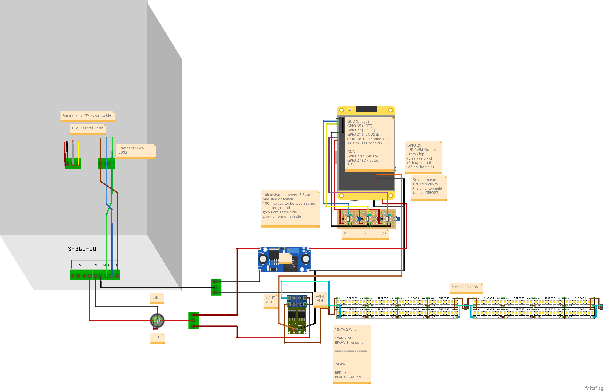

| Function | GPIO | Notes |
|---|---|---|
| LEFT (–) button | 35 | Input only. Needs the external 10k pull-up. |
| RIGHT (+) button | 22 | 10k pull-up + 100nF |
| OK / Enter button | 27 | 10k pull-up + 100nF |

Manually solder to the below pads to access GPIO25 and another ground:
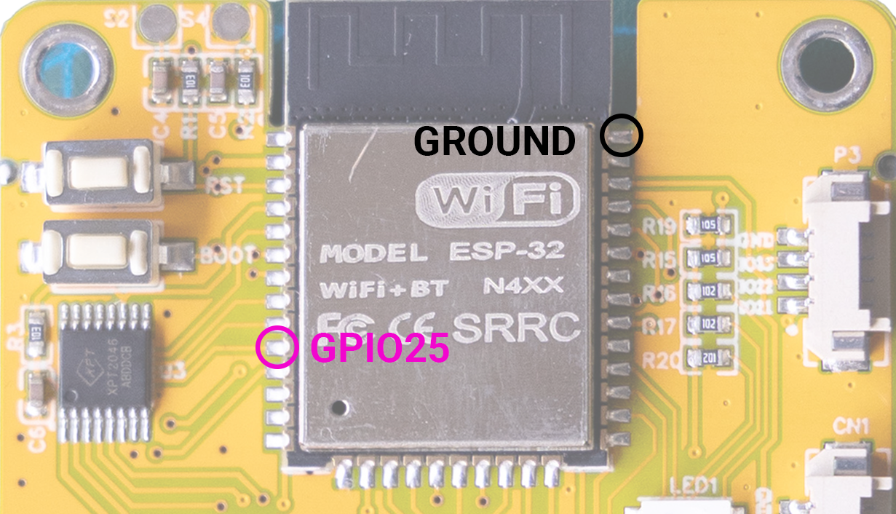

| LED PWM out → MOSFET TRIG/PWM | 25 | **Solder directly to the ESP32 module.** It's the 5th pin up from the bottom-left corner. |
| Ground | GND | **Solder directly to the ESP32 module.** It's the top-right pin, next to the antenna shield. |

> ⚠️ **GPIO 21 is tied to the LCD backlight.** Don't use it for anything else.
> None of the button pins are boot-strapping pins, so holding a button at power-on won't stop the board booting.

---

## Software Setup

1. Install the **Arduino IDE** and the **ESP32 Arduino core v3.x**: Boards Manager → *esp32 by Espressif*. The sketch uses `ledcAttach()` and the v3 ESP-NOW callback.
2. Select the board: **ESP32 Dev Module**.
3. Install the **TFT_eSPI** library (by Bodmer) from the Library Manager.
4. **Set up TFT_eSPI for the CYD with the `User_Setup.h` in this repo:**
   1. Find the TFT_eSPI library folder:
      - **Windows:** `Documents\Arduino\libraries\TFT_eSPI\`
      - **macOS / Linux:** `~/Arduino/libraries/TFT_eSPI/`
   2. Rename the existing `User_Setup.h` there to `User_Setup.h.bak`, as a backup.
   3. Copy `User_Setup.h` from this repo into that folder.
   4. Restart the Arduino IDE.

   > ⚠️ Updating TFT_eSPI through the Library Manager **overwrites `User_Setup.h`**. After any library update, copy this repo's file in again.

   <details>
   <summary>Key settings in the provided User_Setup.h</summary>

   ```cpp
   #define ST7789_DRIVER
   #define TFT_RGB_ORDER TFT_BGR
   #define TFT_INVERSION_OFF
   #define TFT_BL   21
   #define TFT_BACKLIGHT_ON HIGH
   #define TFT_MISO 12
   #define TFT_MOSI 13
   #define TFT_SCLK 14
   #define TFT_CS   15
   #define TFT_DC    2
   #define TFT_RST  -1
   #define LOAD_GLCD
   #define LOAD_FONT2
   #define LOAD_GFXFF      // Required - bold logo font
   #define SMOOTH_FONT
   #define SPI_FREQUENCY 55000000
   #define USE_HSPI_PORT
   ```
   </details>

5. **Give every unit a unique number** before flashing it. Edit near the top of the sketch:
   ```cpp
   #define DEVICE_GROUP_NAME  "ConnectLED"   // Same on every unit in the group
   #define DEVICE_NUMBER      "01"           // UNIQUE per unit: 01, 02, 03 ...
   ```
6. Open `ChannelLED.ino`, connect the CYD over USB and click **Upload**.

You may see this compiler warning. It's safe to ignore because the CYD's touch screen isn't used:
```
TOUCH_CS pin not defined, TFT_eSPI touch functions will not be available!
```

---

## Controls

| Button | Action |
|---|---|
| **–** / **+** | Move between items, or change a value while editing |
| **OK** (press) | Start or confirm editing the highlighted item |

### Button Shortcuts (Hold)

| Shortcut | Buttons |
|---|---|
| 50% Brightness (no animation) | Hold **–** & **+** for 1s, then release |
| All Off | Hold **–** & **+** & **OK** for 1s |
| Switch Mode popup | Hold **OK** for 1s, then release (same again to cancel) |
| Start at 50% brightness | Hold **–** while powering on |
| Skip the Host search | Press **OK** on the boot screen (runs Standalone) |

> **Client mode is view-only.** The menu shows the Host's Brightness, Animation and Speed in compact rows with no sliders. The info box stays on one page: *Controlled by Host*, the **Switch Mode** shortcut (hold **OK**) and the Key. **–**, **+** and the 50% Brightness / All Off shortcuts do nothing. To control a unit on its own, switch it to Standalone.

---

## Modes

| Mode | Name | Behaviour |
|---|---|---|
| **H** Host | `H_ConnectLED` | Leads the group and sends its settings to every Client |
| **C** Client | `C_ConnectLED_<num>` | Follows the Host and reconnects automatically. Controls are view-only. |
| **S** Standalone | `SA_ConnectLED_<num>` | Ignores the group |

- On power-on the unit searches for a Host for 10 seconds:
  - If it hears a Host, it becomes a **Client**.
  - If it hears none, it becomes the **Host**.
- The mode is **not saved**. Every power-on searches again.
- **Switch Mode popup:**
  - Use **–** / **+** to pick the new mode, then **Update**.
  - Becoming a Host is refused if a Host already exists.
  - Becoming a Client with no Host around offers to make this unit the Host instead.
- If two Hosts ever hear each other, the one with the lower MAC address stays Host.

### Status icons (top-right)

| Icon | Meaning |
|---|---|
| 🟢 Chain | Connected |
| 🟡 Broken chain (blinking) | Retrying. The Client is looking for its Host. |
| House | Host |
| Linked node | Client |
| Person | Standalone (no link icon) |

---

## Animations

| Animation | Description |
|---|---|
| None | Steady light at the set brightness |
| Blink | On/off. Speed sets the rate (1000ms → 100ms). |
| Lightning | Random dark gaps and bursts of flicker |
| Strobe | Fast on/off (200ms → 20ms) |
| Chase | Each linked unit fades 0 → 50% → 0 in turn: the Host first, then the Clients in name order. Speed sets the pulse length. |

---

## Customising the Look

Each mode has its own theme in the `VARIABLES` section of the sketch:

```cpp
// { background, backgroundIntensity 0-100, glow, glowIntensity 0-100 }
UiTheme hostTheme       = { 0x08EB, 60, 0x05BF, 40 };  // Blue / cyan
UiTheme clientTheme     = { 0x09C4, 60, 0x07EF, 40 };  // Green
UiTheme standaloneTheme = { 0x38E0, 60, 0xFC60, 40 };  // Orange
```

- **background:** screen background colour (RGB565)
- **backgroundIntensity:** 0 is black, 100 is the background colour at full strength
- **glow:** colour of the frames, highlights and icons
- **glowIntensity:** 0 is no glow, 100 is the strongest glow

Text colours are set in `DEFINES`:

- `MENU_COL_TEXT`: titles (white)
- `MENU_COL_BODY`: everything else (grey)

The boot screen always uses the Host theme.

### Themes

| Host | Client | Standalone |
|---|---|---|
| 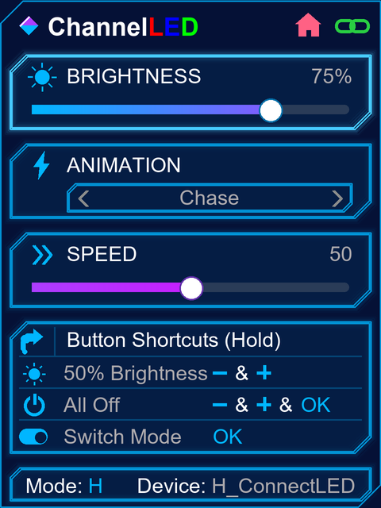 | 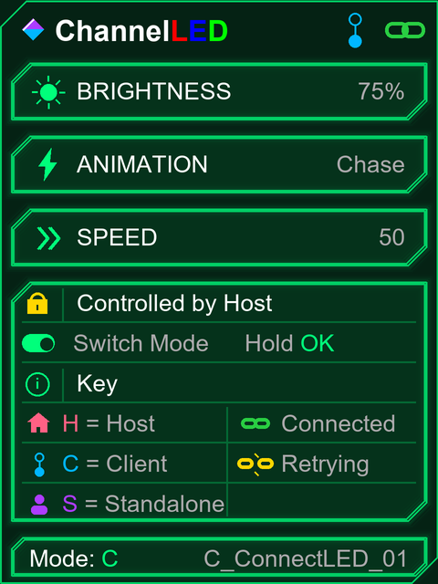 | 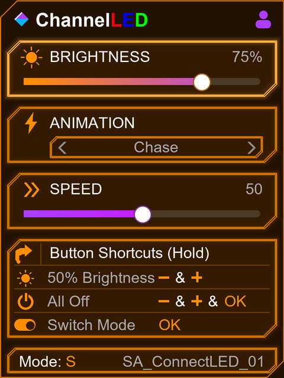 |

### Screens

| Boot | Key | Editing |
|---|---|---|
| 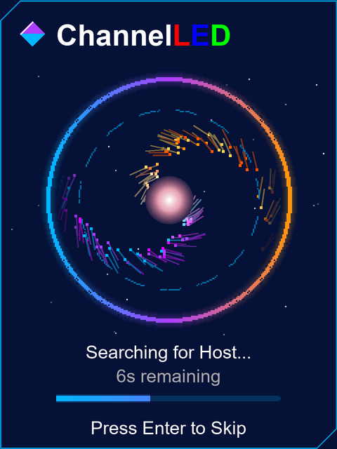 | 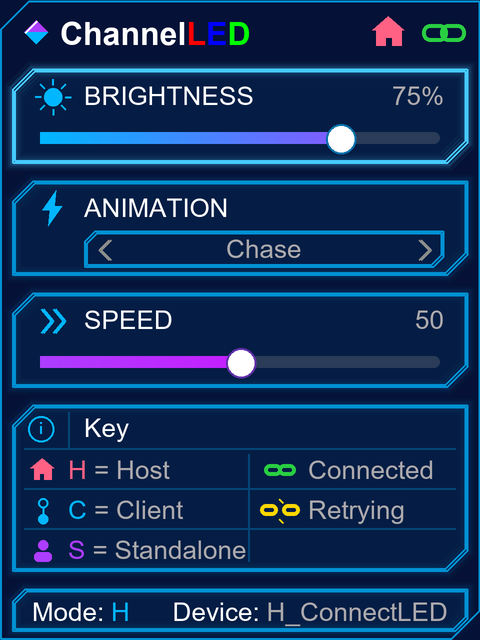 | 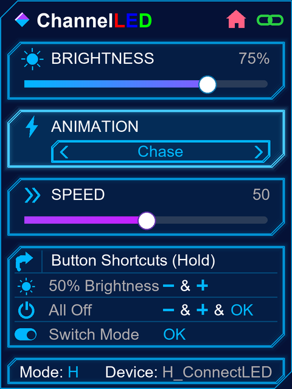 |

| Switch Mode | Mode Updated | Client Retrying |
|---|---|---|
| 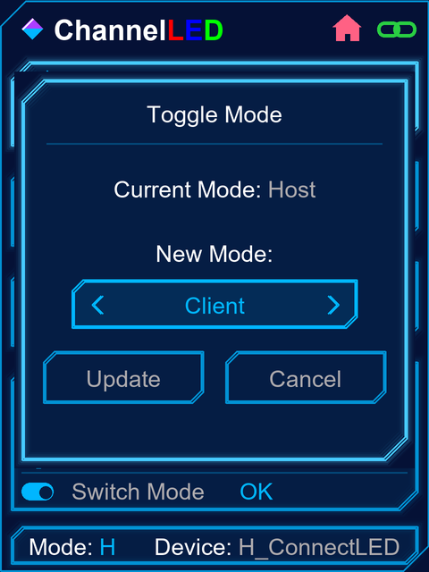 | 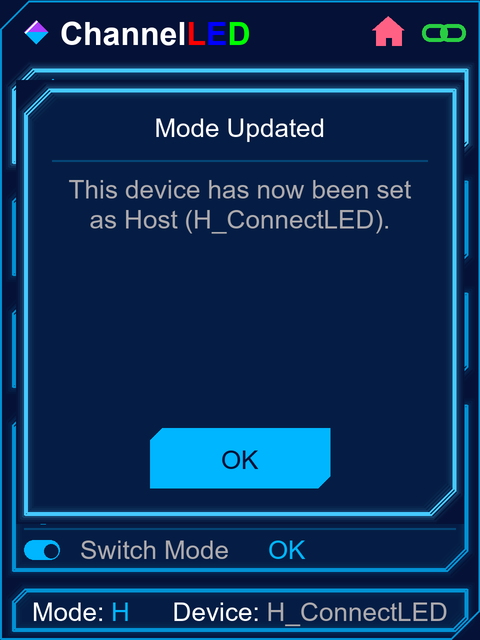 | 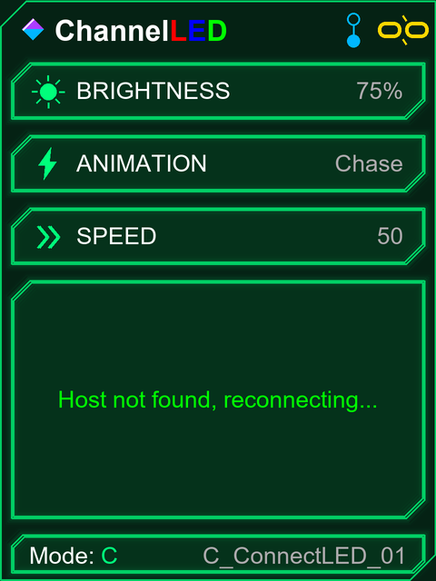 |

---

## Disclaimer for AI use

Parts of this code were written with the help of Claude Code. I've tested it and run it on my own hardware, but as with any code, results may vary. Review it before you run it. I'm not accountable for any damage or issues arising from its use.

**2026 Disaster of Puppets** — have fun :)
